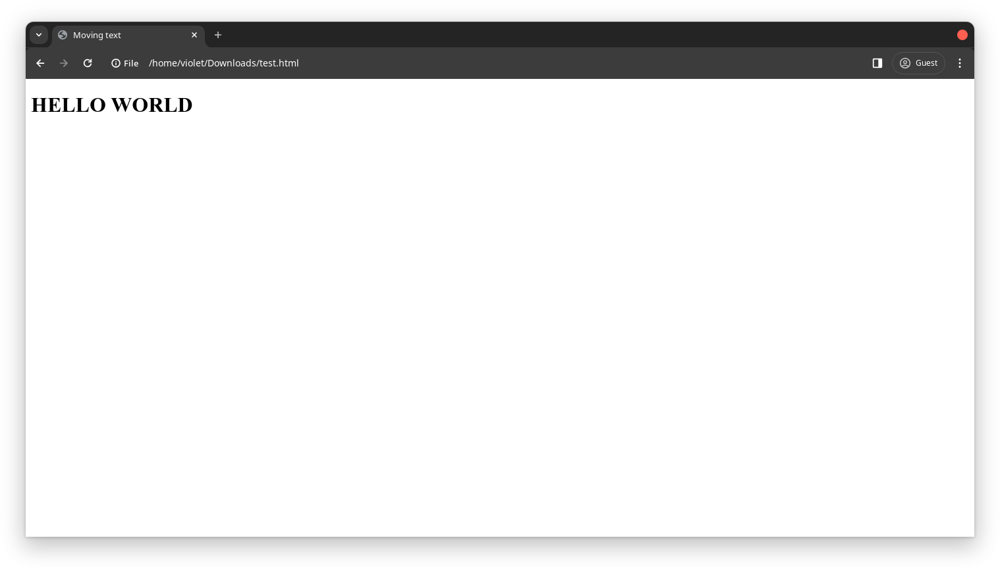
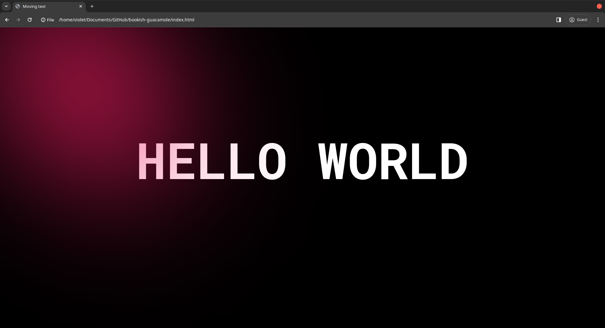

# _Bookish-Guacamole_

It's a website that showcases some of the cool css effects that help's with UX/UI designing which can convert any boring website into a fancy and interactive good looking website.

## Here is an example

I created a simple website which has **_Hello World._**

###### Index.html

```html
<!DOCTYPE html>
<html lang="en">
  <head>
    <meta charset="UTF-8" />
    <meta name="viewport" content="width=device-width, initial-scale=1.0" />
    <title>Moving text</title>
  </head>
  <body>
    <h1 data-value="HELLO WORLD">HELLO WORLD</h1>
  </body>
</html>
```

this will just print a **_Hello world._**

Right now this sight is _~~plain and boring~~_ which we do not want in our website so let's add some **styling**.

###### style.css

```css
@import url("https://fonts.googleapis.com/css2?family=Roboto+Mono:ital,wght@0,100;0,200;0,400;0,700;1,100;1,200;1,300;1,400;1,500;1,700&display=swap");

body {
  background-color: black;
  overflow: hidden;
  justify-content: center;
}

h1 {
  color: white;
  font-size: 10rem;
  font-family: "Roboto Mono", cursive;
  text-align: center;
  z-index: 1;
}

@keyframes rotate {
  from {
    rotate: 0deg;
  }
  50% {
    scale: 1 1.25;
  }
  to {
    rotate: 360deg;
  }
}

#center {
  height: 200px;
  width: 200px;
}

#blur {
  height: 100%;
  width: 100%;
  position: absolute;
  z-index: 2;
}

#blob {
  position: absolute;
  height: 500px;
  aspect-ratio: 1;
  position: absolute;
  left: 50%;
  top: 50%;
  translate: -50% -50%;
  border-radius: 50%;
  background-color: rgb(235, 29, 97);
  animation: rotate 20s infinite;
  filter: blur(200px);
  z-index: 3;
}
```

now the website has a cool theme.

But it's still not interactive, which makes the website look even better and fun. So let's add some javascript.

but first we need to update our html file.

###### Index.html

```html
<!DOCTYPE html>
<html lang="en">
  <head>
    <meta charset="UTF-8" />
    <meta name="viewport" content="width=device-width, initial-scale=1.0" />
    <title>Moving text</title>
    <script defer src="index.js"></script>
    <script defer src="new.js"></script>
    <link rel="stylesheet" href="style.css" />
    <link rel="preconnect" href="https://fonts.googleapis.com" />
    <link rel="preconnect" href="https://fonts.gstatic.com" crossorigin />
    <link
      href="https://fonts.googleapis.com/css2?family=Roboto+Mono:ital,wght@0,100;0,200;0,400;0,700;1,100;1,200;1,300;1,400;1,500;1,700&display=swap"
      rel="stylesheet"
    />
  </head>
  <body>
    <div id="center"></div>
    <h1 data-value="HELLO WORLD">HELLO WORLD</h1>
    <div id="blob"></div>
    <div id="blur"></div>
  </body>
</html>
```

now let's add some javascript

###### Index.js

```js
const blob = document.getElementById("blob");
document.body.onpointermove = (event) => {
  const { x, y } = event;
  blob.animate(
    {
      left: `${x}px`,
      top: `${y}px`,
    },
    { duration: 10000, fill: "forwards" }
  );
};
```

this will create a blob that moves where ever the mouse moves.

now let's mke the text change when the mouse hovers on the text.

###### new.js

```js
const letters = "ABCDEFGHIJKLMNOPQRSTUVWXYZ";
document.querySelector("h1").onmouseover = (event) => {
  let count = 0;
  const interval = setInterval(() => {
    event.target.innerText = event.target.innerText
      .split("")
      .map((letter, index) => {
        if (index < count) {
          return event.target.dataset.value[index];
        }
        return letters[Math.floor(Math.random() * 26)];
      })
      .join("");
    if (count >= event.target.dataset.value.length) {
      clearInterval(interval);
    }
    count += 1 / 3;
  }, 50);
};
```

and that's it our website is now cool and fancy.

## Here is the Output

### before css



### after css



[Click here]('https://cool-effects.netlify.app') To see and interact with the website

And we have transformed our website into a cool & fancy looking website.
